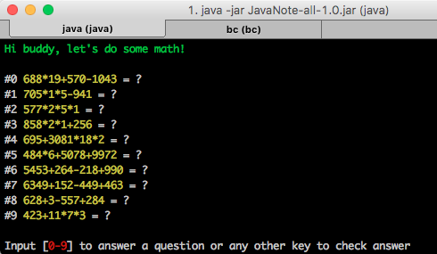
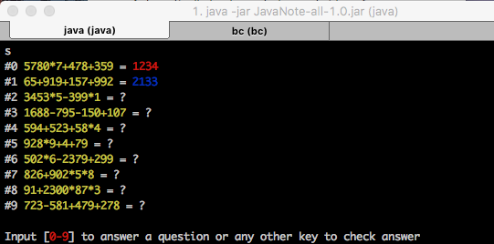

# README

This is my little playground of Java and the other JVM languanges (e.g. Kotlin). 

Run this to build a fat jar:

```
./gradlew fatjar
```

Some useful codes and apps are included:

- [ShuntingYard.kt](src/main/kotlin/ShuntingYard.kt)
  - An implementation of [shunting yard algorithm](https://en.wikipedia.org/wiki/Shunting-yard_algorithm) to parse mathematical expressions specified in infix notation and produce [Reverse Polish notation](https://en.wikipedia.org/wiki/Reverse_Polish_notation).
  - A function to evaluate [Reverse Polish notation](https://en.wikipedia.org/wiki/Reverse_Polish_notation).
- [ArithmeticGenerator.kt](src/main/kotlin/ArithmeticGenerator.kt): generate elementary arithmetic problems randomly, but follow pre-defined rules, for example the number of operators, how many digits each number should have and what are the possiblities, if negative result is allowed during the calculation, etc.
- [Arithmetic.kt](src/main/kotlin/Arithmetic.kt) is a console to randomly generate elementary arithmetic problems. I make my son solve the problems it generates and it only finishes while all problems are solved correctly. Some screenshots. Working on an Android version now.




 